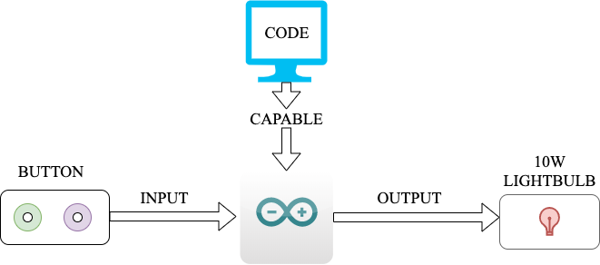
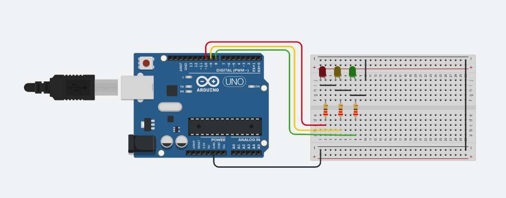
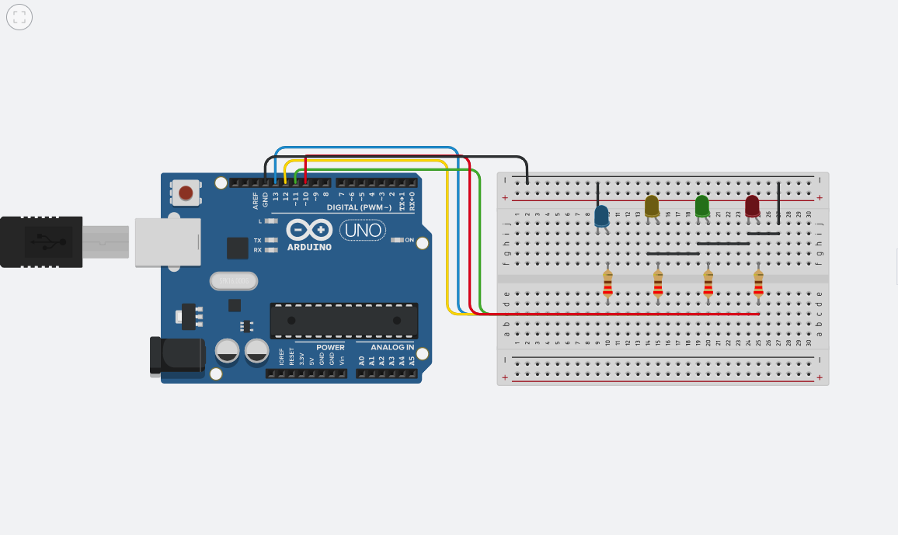
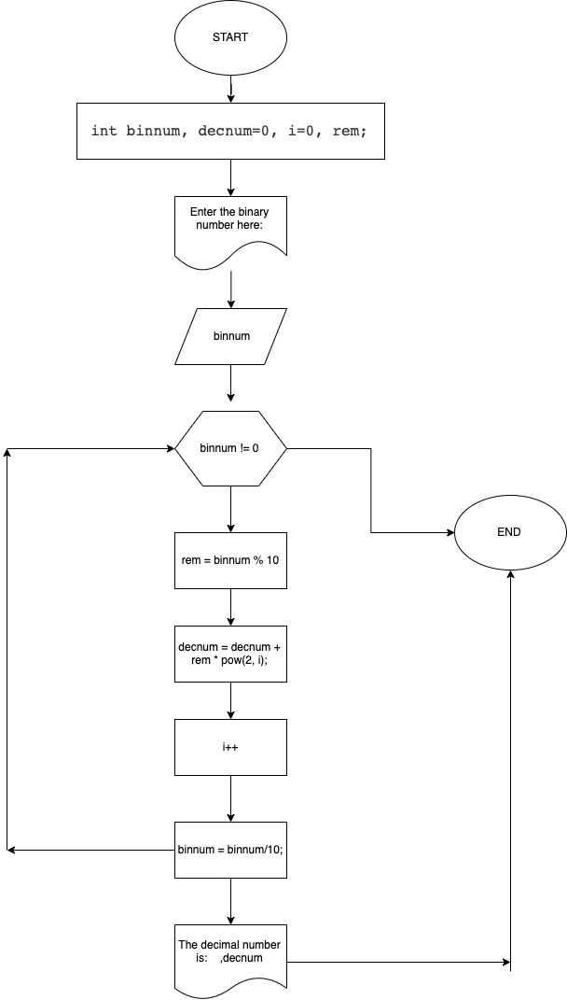
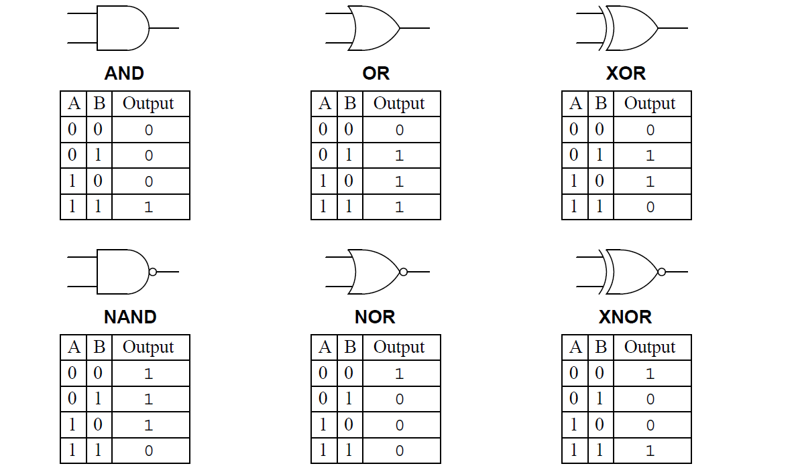
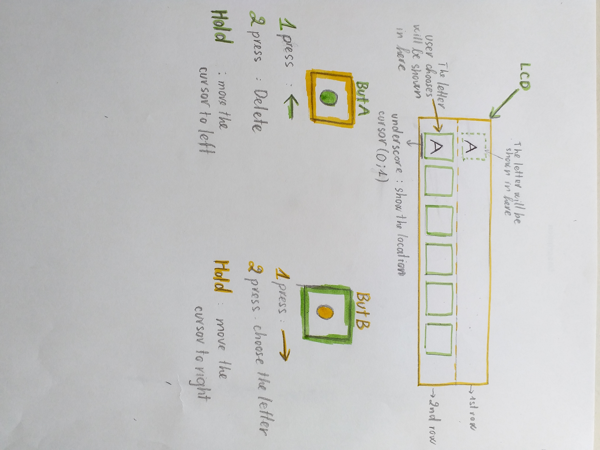
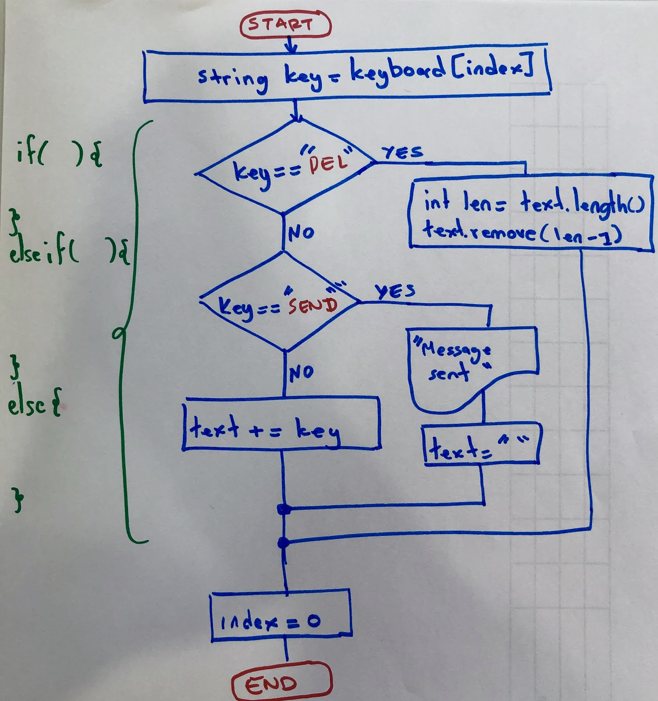
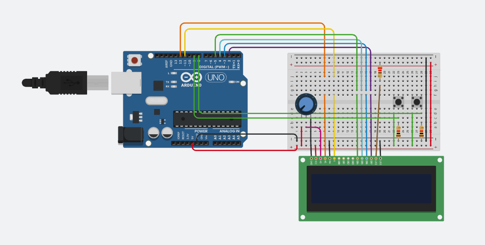
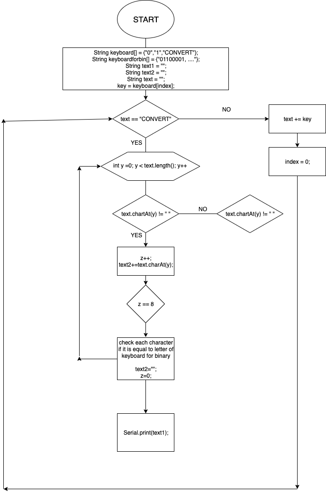

 
 
 
 # TRANSMITTER LANGUAGE UNIT 2
                                   

Content
---------

1. [Planning](#planning)
1. [Design](#design)
1. [Development](#development)
1. [Evaluation](#evaluation)
1. [Reference](#reference)

Planning
-----------
### Defining problem 

The year is 2050. NASA has successfully in exploring Mars, Moon and transport human come to live there. Planet exploration is a thing, however, communication is still precarious. NASA wants to make transmitters in these three planets: Earth, Moon and Mars. It is not easy to communicate with people in different planets. Due to the people from Earth only can receive and send the Morse information. Moreover, the people from MArs can only receive and send the Binary information. And the people from Moon can send and receive both two types of information. The people from the Moon have to act as a liaison which both receive and transmit information from Earth and Mars. So the people on Moon have to translate information from decimal to binary, from binary to morse and vice versa. 

We were chosen to make the transmitter. 

### Solution Proposed

The transmitters are feasible to make. We decided to use Arduino to make the keyboard and transmitters and 100W bulb lights for sending the information inputted from the users. The Arduino is really easy to use and build. With the basic level of C programming and building you can easily use Arduino effectively. Hence The Teachnical feasibility is not a big problem for making the transmitter. Also, the price for Arduino tool kits, 100W bulb lights are cheap, not a big issue with the big company like NASA. So the economic factor for this program is fesible. As mentioned before, Arduino is easy to use so we do not need to spend too much money and time training people to use it. We will make a table to show the binary and morse code for each English character. The operational fesibility is also done . All the information is inputted by the users and no one has ever legally made this program so this program is legal. The keyboard with just only 2 buttons and the Arduino is easy to use so master using the transmitter takes not much time. The users only need half a week to practice using it. And, it takes under 1 week to build the transmitter and training the users to do it. Therefore, this program is fesible and realistic.

### Success Criteria

These are measurable outcomes:

   1. The keyboard with 2 buttons allows users to input choosing the options and letters
   2. The transmitter can transmit the information correctly from english to binary, from binary to morse and vice versa. 
   3. User can choose and delete the letters
   4. The bulb light is used effeciently in the communication, there is no issue for the bulblight like broken or too old.  
   5. The bulb light need to represent correctly when turn on or off as for the information
   6. An LCD screen shows the available letter options and the letter users choose.
   7. There will be options for users to choose between transmit to binary or morse
   8. There will be options for users to convert from binary to english, morse to english
   9. There will be options for users to send the message to the light bulbs
   
Design
--------


**Fig. 1** The sketch of the system show the main Input and Output components, actions and software requirement.


**Fig. 2** This is the arduino of the traffic light 


**Fig. 3** This is the arduino of the counter binary



**Fig. 4** The flow chart for converting decimal number to binary number



**Fig. 4** Type of logic gate

**Table of creating number segment**

| But A | But B | But C | Decimal | LED A | LED B | LED C | LED D | LED E | LED F | LED G |
|:----:|:----:|:----:|:----:|:----:|:----:|:----:|:----:|:----:|:----:|:----:|
|0|0|0|0|1|1|1|1|1|1|0|
|0|0|1|1|0|1|1|0|0|0|0|
|0|1|0|2|1|0|1|1|0|1|1|
|0|1|1|3|1|0|0|1|1|1|1|
|1|0|0|4|0|1|0|0|1|1|1|
|1|0|1|5|1|1|0|1|1|0|1|
|1|1|0|6|1|1|1|1|1|0|1|
|1|1|1|7|1|0|0|0|1|1|0|

Based on this truth table, the problem can be easily solved with logic gates. We can create equation for each light then it will show us the number we want.


**Fig. 5** The design of English Input system with 2 buttons

**Fig. 6** The flow chart for send and add english text


**Fig. 7** The arduino design of Enlish system with 2 buttons



**Fig. 8** The flow chart of function convert binary to english

### Type of data in Arduino
    boolean (8 bit) - simple logical true/false
    byte (8 bit) - unsigned number from 0-255
    char (8 bit) - signed number from -128 to 127. 
    unsigned char (8 bit) - same as 'byte'; 
    word (16 bit) - unsigned number from 0-65535
    unsigned int (16 bit)
    int (16 bit) - signed number from -32768 to 32767. 
    unsigned long (32 bit) - unsigned number from 0-4,294,967,295. 
    long (32 bit) - signed number from -2,147,483,648 to 2,147,483,647
    float (32 bit) - signed number from -3.4028235E38 to 3.4028235E38

### Usability 

Usability is according to Wikipedia[1] the degree of wase with which a product can be used to achieve their goals. It studies the elegance, clarity, intuitive with which the computer program. 

### Human-centered design HCD

Human-centerd design HCD according to Wikipedia[2] is an approach to problem solving, commonly used in design and management frameworks that develops solutions to problems by involving the human perspective in all steps of the problem-solving process. Human involvement typically takes place in observing the problem within context, brainstorming, conceptualizing, developing, and implementing the solution.

### Compare Bash and Arduino programing languge
① Advantages of bash and arduino

   | Bash | Arduino |
   | :--- | :--- |
   |Easy to learn and use| Compatible with many different platform |
   |Powerful, doing tasks in computer like: deleting, adding, creating files,... with just typing| Various type of data |
   |Can see the output immediately after finishing coding in the same app where writing code| Well suited with the large and complex task|
   |The command and syntax are exactly the same as those directly entered in command line, so programmer do not need to switch to entirely different syntax| Fast, effecient language|
   |Much quicker when writing code with bash| It is very easy to understand, it uses keywords like: if, switch, void,.. |
   |Customizing administrative tasks| You can easily find the error |
   |Quick start, and interactive debugging| |
   |No need to declare the type of data| |
   |No need to use ; to end a statement| |
   |No need to close a comment||

② Disadvantages of bash and arduino

   | Bash | Arduino |
   | :--- | :--- |
   |Prone to costly errors, a single mistake can change the command which might be harmful| Cannot do administrator tasks|
   |Slow execution speed| Need to declare the type of data|
   |Not well suited with the large and complex task| Need to close a comment|
   |Provide minimal data structure unlike other scripting languages| Need to ; to end a statement|
   |Limited data types| |
   |Compatibility problems between different platforms| |

③ Comparison of bash and arduino
   
   | Bash | Arduino |
   | :--- | :--- |
   | In bash, the for loop use curly braces for the statement that need to repeat. There are 3 parameters in the curly braces: initialization, condition and increment. You do not need to declare the data type of variable that you will use in your code. Moreover, you have to use do when opening a statement, done when closing the statement for the for loop. Next, at the end of the statement we do not need to use ";" to end the statement. When using a variable, you need to use "$" before the name of the variable. Then, to make a comment, you just use "#" to open a comment line. We use "echo" to print String or variable. Then, bash is a powerful programming language, it can do the administrator task| In Arduino,like bash we use curly braces for the statement that need to repeat. Also it has the same 3 parameters as in bash. You have to declare all the variable that you use in your program or it will cause errors. Next, the for loop just need to have open and close brackets for the statement. ";" is the compulsory thing in Arduino code, we have to use it to end the statement or it will cause errors. In the contrast of bash, arduino code does not require "$" when using variable. When making a comment, you need to open and close (using /* )the comment. We use "print" to print the string or variables. Arduino programming language cannot execute the administrator task like adding, deleting,.. files, folders.  |
   ### Logic gate
   
   A logic gate is a building block of a digital circuit. Most logic gates have two inputs and one output and are based on Boolean algebra. At any given moment, every terminal is in one of the two binary conditions false (high) or true (low). False represents 0, and true represents 1. Depending on the type of logic gate being used and the combination of inputs, the binary output will differ. A logic gate can be thought of like a light switch, wherein one position the output is off—0, and in another, it is on—1.  Logic gates are commonly used in integrated circuits (IC).[4]
   
   ### Interruption on Arduino
   When Arudino running, it will check every line of code in a very small amount of time: 10ms. So if the users want to input by using press button or other devices, the users need to be very fast or just repeat pressing the button until the Arduino check the line that contain the code for input. That is time consuming and inconvinient, it also makes the code run wrongly. We use interuption to solve this problem. Interrupts are useful for making things happen automatically in microcontroller programs and can help solve timing problems.
   
   Syntax:  attachInterrupt(pin, ISR, mode)
      
   pin: the Arduino pin number.
      
   ISR: the ISR to call when the interrupt occurs; this function must take no parameters and return nothing. This function       is sometimes referred to as an interrupt service routine.
      
   mode: defines when the interrupt should be triggered. Four constants are predefined as valid values:

         - LOW to trigger the interrupt whenever the pin is low,

         - CHANGE to trigger the interrupt whenever the pin changes value

         - RISING to trigger when the pin goes from low to high,

         - FALLING for when the pin goes from high to low.
   ### Debouncing button
   Pushbuttons often generate spurious open/close transitions when pressed, due to mechanical and physical issues: these transitions may be read as multiple presses in a very short time fooling the program. Debounce means checking the input twice in a short period of time to make sure the pushbutton is definitely pressed. Without debouncing, pressing the button once may cause unpredictable results.[3]
   
   ### Protocol
   
   | NAME | CREATOR | SUMMARY |
   | :---: | :---: | :---: |
   |IP|Vint Cerf & Bob Kahn| Interface identification addresss in the network|
   |FTP|Abhay Bhusan| Transfer file between client and server|
   |SSH|Tatu Ylonen|Log into a remote machine and execute commands|
   |SMTP|RFC821|Send/receive emails|
   |Telnet|UCLA| Uesd on the internet or local area network|
   |POP3|Mark Crispin| Send/receive emails and download emails|
   |HTTP|Tim Berners-Lee| Used on worldwide web for anything clickable (hyperlinks,etc)|
   |VPN|Gurdeep Singh-Pall| Provides encrypted internet connections|
    
   Based off this information and knowledge about protocols, we now worked together to find a common protocol for our communication between Earth, the Moon, and Mars. 
    
   ### Machine cycle
   
   A machine cycle consists of the steps that a computer’s processor executes whenever it receives a machine language instruction. It is the most basic CPU operation, and modern CPUs are able to perform millions of machine cycles per second. The cycle consists of three standard steps: fetch, decode and execute. In some cases, store is also incorporated into the cycle.
   
   The steps of a machine cycle are:
   
   Fetch – The control unit requests instructions from the main memory that is stored at a memory’s location as indicated by the program counter (also known as the instruction counter).
   Decode – Received instructions are decoded in the instruction register. This involves breaking the operand field into its components based on the instruction’s operation code (opcode).
   Execute – This involves the instruction’s opcode as it specifies the CPU operation required. The program counter indicates the instruction sequence for computer. These instructions are arranged into the instructions register and as each are executed, it increments the program counter so that the next instruction is stored in memory. Appropriate circuitry is then activated to perform the requested task. As soon as instructions have been executed, it restarts the machine cycle that begins the fetch step.  
        
Development
------------
### 1. Traffic light

①　Declare the port number of each LED light and set the LED light as OUPUT
   ```.ino       
      int red = 10;
      int yellow = 9;
      int green = 8;
      
      void setup(){
      pinMode(red, OUTPUT);
      pinMode(yellow, OUTPUT);
      pinMode(green, OUTPUT);
      }
  ``` 


**Gif1** This is the result after making the arduino for the traffic light

② Declare function changeLight(){}

      void changeLights(){}
      
③　Write code for the traffic light inside the changeLight function
```.ino
    # Turn the green ligh off, the yellow light turns on 
       digitalWrite(green, LOW);
       digitalWrite(yellow, HIGH);
       delay(3000);
       
    # Turn off the yellow light, then turn on the red light
      digitalWrite(yellow, LOW);
      digitalWrite(red, HIGH);
      delay(5000);

    # Turn on the red and yellow light
      digitalWrite(yellow, HIGH);
      delay(2000);
    
    #  Turn off the red and yellow light, turn on the green light     
      digitalWrite(yellow, LOW);
      digitalWrite(red, LOW);
      digitalWrite(green, HIGH);
      delay(3000);
 ```
 ④　Execute the function changeLight inside the void loop() {}
 ```.ino
      void loop(){
      changeLights();
      delay(15000);
     }  
 ```  
### 2. The blink LED
```.ino
          int redLED = 13;
          
          void setup() {
            pinMode(redLED, OUTPUT);
          }
          
          void loop(){
            blinkRED(1000);
            blinkRED(100);
          }
          
          void blinkRED(int t){
          digitalWrite(redLED, HIGH);
          delay(t);
          digitalWrite(redLED, LOW);
          delay(t);
          }
 ```
### 3. The counter from 1 to 15 binary number
 ```.ino
          void setup()
          {
           pinMode(A, OUTPUT);
           pinMode(B, OUTPUT);
          pinMode(C, OUTPUT);
          pinMode(D, OUTPUT);
          }

          void loop()
          {
          for (i = 0; i <= 15; i += 1)
          {
          if (i%2 == 1)
          {
          digitalWrite (D, HIGH);
          } 
          if (i%4 > 1)
          {
          digitalWrite (C, HIGH);
          }
          if (i%8 > 3) 
          {
          digitalWrite (B, HIGH);
          }
          if (i%16 > 7)
          {
          digitalWrite (A, HIGH);
          }
          delay (300);
          digitalWrite (D, LOW);
          digitalWrite (C, LOW);
          digitalWrite (B, LOW);
          digitalWrite (A, LOW);
    
          }
          }  
 ```
 
 
 **Gif2** This is the counter Binary number from 1 to 15 

### 4. The number segements
①　 Declare all the Led and button pin
```.ino
          int LEDA = 1;
          int LEDB = 2;
          int LEDC = 3;
          int LEDD = 4;
          int LEDE = 5;
          int LEDF = 6;       
          int LEDG = 7;
          int butA = 10;
          int butB = 11;
          int butC = 12;
```
②　Declare the input and output
```.ino
　　　　　void setup()
       {
          pinMode(LEDA, OUTPUT);
          pinMode(LEDB, OUTPUT);
          pinMode(LEDC, OUTPUT);
          pinMode(LEDD, OUTPUT);
          pinMode(LEDE, OUTPUT);
          pinMode(LEDF, OUTPUT);
          pinMode(LEDG, OUTPUT);
          pinMode(butA, INPUT);
          pinMode(butB, INPUT);
          pinMode(butC, INPUT);
  
        }
```
③　Logic gate equation for each LED
```.ino
       void loop()
         {
          bool A = digitalRead(butA);
          bool B = digitalRead(butB);
          bool C = digitalRead(butC);
          bool a = (!C & !A) | (B & !A) | (!C & A) | (A & !B);
          bool b = (!C & A) | (!B & !A) | (A & !B);
          bool c = (!A & !C) | (!A & !B) | (!C & B);
          bool d = (!A & !C) | (!A & B) | (B & !C) | (C & A & !B);
          bool e = A | (!C & !B) | (C & B);
          bool f = (!A & B) | (!C & !A) | (!C & !B);
          bool g = (!A & B) | (B & !C) | (A & !B);
          digitalWrite(LEDA, a);
          digitalWrite(LEDB, b);
          digitalWrite(LEDC, c);
          digitalWrite(LEDD, d);
          digitalWrite(LEDE, e);
          digitalWrite(LEDF, f);
          digitalWrite(LEDG, g);
                    
       }
   ```


**Gif3** This is the Number Segment with 7 LEDs (it can show us number from 0 to 7)

### 5. Debouncing button

①　Declare the button and the led pin number and state
```.ino
const int buttonPin = 2;    // the number of the pushbutton pin
const int ledPin = 13;      // the number of the LED pin

// Variables will change:
int ledState = HIGH;         // the current state of the output pin
int buttonState;             // the current reading from the input pin
int lastButtonState = LOW;   // the previous reading from the input pin

// the following variables are unsigned longs because the time, measured in
// milliseconds, will quickly become a bigger number than can be stored in an int.
unsigned long lastDebounceTime = 0;  // the last time the output pin was toggled
unsigned long debounceDelay = 50;    // the debounce time; increase if the output flickers
```
② Set initial LED state
```.ino
void setup() {
  pinMode(buttonPin, INPUT);
  pinMode(ledPin, OUTPUT);
  
  digitalWrite(ledPin, ledState);
}
```
③　double check the state of the buttons
```.ino
void loop() {
  // read the state of the switch into a local variable:
  int reading = digitalRead(buttonPin);

  // check to see if you just pressed the button
  // (i.e. the input went from LOW to HIGH), and you've waited long enough
  // since the last press to ignore any noise:

  // If the switch changed, due to noise or pressing:
  if (reading != lastButtonState) {
    // reset the debouncing timer
    lastDebounceTime = millis();
  }

  if ((millis() - lastDebounceTime) > debounceDelay) {
    // whatever the reading is at, it's been there for longer than the debounce
    // delay, so take it as the actual current state:

    // if the button state has changed:
    if (reading != buttonState) {
      buttonState = reading;

      // only toggle the LED if the new button state is HIGH
      if (buttonState == HIGH) {
        ledState = !ledState;
      }
    }
  }

  // set the LED:
  digitalWrite(ledPin, ledState);

  // save the reading. Next time through the loop, it'll be the lastButtonState:
  lastButtonState = reading;
}
```
### 6. Debounce button
```.ino
// Declare
const byte ledPin = 13;
const byte interruptPin = 2;
volatile byte state = LOW;

void setup() {
  pinMode(ledPin, OUTPUT);
  pinMode(interruptPin, INPUT_PULLUP);
  // the program will interrupt the Arduino and run the blink function
  attachInterrupt(digitalPinToInterrupt(interruptPin), blink, CHANGE); 
}

void loop() {
  digitalWrite(ledPin, state);
}

void blink() {
  state = !state;
}

```

### 7. English Input System

①  Add all the letters and digits to the keyboard
```.ino
int index = 0;
String keyboard[]={"A", "B", "C", "D", "E", "F", "G", "H", "I", "J", "K", "L", "M", "N", "O", "P", "Q", "R", "S", "T", "U", "V", "W", "X", "Y", "Z", " ", "0", "1", "2", "3", "4", "5", "6", "7", "8", "9", " ","SENT", "DEL"};
String text = "";
int numOptions = 40;
```
②  Initialize the library with the numbers of the interface pins
```.ino
LiquidCrystal lcd(12, 11, 5, 4, 9, 8);
```
③ Function changes the letter in the keyboard
  ```.ino
  void changeLetter(){
  static unsigned long last_interrupt_time = 0;
  unsigned long interrupt_time = millis();
  if (interrupt_time - last_interrupt_time > 200)
  {
  
    last_interrupt_time = interrupt_time;// If interrupts come faster than 200ms, assum
    index++;
      //check for the max row number
    if(index==numOptions){
      index=0; //loop back to first row
    }                                   
 }
}
```
④ Function add the letter to the text or send the message
 ```.ino
 void selected(){
  static unsigned long last_interrupt_time = 0;
  unsigned long interrupt_time = millis();
  if (interrupt_time - last_interrupt_time > 200)
  {
  
    last_interrupt_time = interrupt_time;// If interrupts come faster than 200ms, assum
    
    String key = keyboard[index];
    if (key == "DEL")
    {
      int len = text.length();
      text.remove(len-1);
    }
    else if(key == "SENT")
    {
      text="";
    }else{
      text += key;
    }
    index = 0; //restart the index
  }
 ```
⑤  Set up the LCD's number of columns and rows. And print message to the LCD
```.ino
void setup() {
  lcd.begin(16, 2);
  attachInterrupt(0, changeLetter, RISING);//button A in port 2
  attachInterrupt(1, selected, RISING);//button B in port 3
}
```
⑥ Run the program in the loop
```.ino
void loop() {
  // set the cursor to column 0, line 1
  // (note: line 1 is the second row, since counting begins with 0):
  lcd.clear();
  lcd.setCursor(0, 0);
  lcd.print(keyboard[index]);
  lcd.setCursor(0, 1);
  lcd.print(text);
  delay(100);
}
```
### 8. Small development on moving the LCD screen to left and right
 ①　Declare the libraries, number of LCD interface pins, the button pin numbers.
 ```.ino
 // include the library code:
#include <LiquidCrystal.h>

// initialize the library with the numbers of the interface pins
LiquidCrystal lcd(12, 11, 5, 4, 7, 6);

int but1 = 2;
int but2 = 3;
int press1 = 0;
int press2 = 0;
int x =0;
String text = "";

char letter[]={'a','b','c','d','e','f','g','h','i','j','k','l','m','n','o','p','q','r','s','t','u','v','x','y','z','w','1','2','3','4','5','6','7','8','9','0', ' '};
```
②　Set up the LCD and print the letter to LCD
```.ino
void setup() {
  // set up the LCD's number of columns and rows:
  lcd.begin(16, 2);
  
  pinMode(but1, INPUT);
  pinMode(but2, INPUT);
  
  for(int i=0; i < 38; i++){
    lcd.print(letter[i]);
    delay(100);
  }   

}
```
③　Declare function for each button
  ```.ino
 void hpress1(){
    
   long last_interrupt_time = 0;
   long interrupt_time = millis();
   long timepress2 = millis();
   if(interrupt_time - last_interrupt_time > 200) {
     if(digitalRead(but1) == HIGH){
      press1++;
     } if (press1 == 1){
        x--;
        press1 = 0;
        lcd.scrollDisplayLeft();
      
   }
     timepress2 = last_interrupt_time;
 }
 }
  void hpress2(){
    
   long last_interrupt_time1 = 0;
   long interrupt_time1 = millis();
   long timepress1 = millis();
   if(interrupt_time1 - last_interrupt_time1 > 200) {
      if(digitalRead(but2) == HIGH){
      press2++;
     } if (press2 == 1){
        x++;
        press2 = 0;
      lcd.scrollDisplayRight();  
     
     
   last_interrupt_time1=interrupt_time1;
   timepress1 = last_interrupt_time1;  
   }
  }
  }
```
④。Run the interruption
```.ino
void loop() {
  attachInterrupt(0, hpress1, CHANGE);
  attachInterrupt(1, hpress2, CHANGE);
}
```


**Gif4** This is the LCD scroll

### 9. One button combination
① Declare the variables, led and button
```.ino
// include the library code:
#include <LiquidCrystal.h>

// initialize the library with the numbers of the interface pins
LiquidCrystal lcd(12, 11, 5, 4, 3, 6);

int presscounter = 0;   
int presscounter1 = 0;
String setcode = "";
String pass = "";
const int led = 8;
const int button = 2;
unsigned long interrupt_time = millis();
unsigned long interrupt_time1 = millis();

void setup() {
  Serial.begin(9600);
  lcd.begin(16, 2);
  pinMode(led, OUTPUT);
  pinMode(button, INPUT);

}
```
② Create function
```.ino

void setcode1(){       // This function will track the time when the user set the password
    presscounter++;
    interrupt_time = millis();
  }   
void setcode2(){        // This function will track the time when the user enter the password
    presscounter1++;
    interrupt_time1 = millis();
}


void blink(){      // This function will blink the LED
     digitalWrite(led, HIGH);
     delay(600);
     digitalWrite(led, LOW);
     delay(500);
}

void check1(){      // This function will check if the lenth of the password that the user setting is equal to 3
  if(setcode.length() == 3){
    digitalWrite(led, HIGH);
    delay(2000);
    digitalWrite(led, LOW);
    delay(1000);
    lcd.clear();
    lcd.setCursor(0,0);
    lcd.print("The password is set!");
    for(int a = 0; a < 19; a++){     // This helps display the whole text 
     lcd.scrollDisplayLeft();
      delay(250);
    }
    lcd.clear();
  }
}

void check2(){       //This function will check if the passcode enter is correct
  if(pass.length() == 3 && pass == setcode){       //If the user has done with enterering password and the password is correct
    lcd.clear();
    lcd.setCursor(0,0);
    lcd.print("The password is correct!");
    for(int a = 0; a < 25; a++){
     lcd.scrollDisplayLeft();
      delay(250);
    }
    for(int b = 0; b < 25; b++){
     lcd.scrollDisplayRight();
    }
    lcd.setCursor(0,1);
    lcd.clear();
    lcd.print("Unlock!");
    delay(2000);
    lcd.clear();
    digitalWrite(led, HIGH);
    delay(3000);
    digitalWrite(led, LOW);
    delay(1000);
    lcd.clear();
    lcd.setCursor(0,1);
    lcd.print("Lock!");
    lock();
  } else if (pass.length() == 3 && pass != setcode){  //If the password is wrong
    for (int z = 0; z < 3; z++){
      blink();
      lcd.clear();
      lcd.setCursor(0, 0);
      lcd.print("Wrong!!!");
      pass="";
    }
  }
}

void lock(){
   pass="";
}

```
③ 
```.ino
void loop() {
  unsigned long time = millis();

  if (setcode.length() < 3) {
   lcd.setCursor(0, 0);
  lcd.print("Set password:");
  attachInterrupt(0, setcode1, RISING);
  if(time - interrupt_time >= 3000 && presscounter != 0){
 
    for(int x = 0; x < presscounter; x++){
      blink();
    } 
    setcode+=presscounter;
    lcd.setCursor(0, 1);
    lcd.print(setcode);
    presscounter=0;
    check1();
 
  } 
  } else if(setcode.length() == 3) {
    lcd.setCursor(0, 0);
    lcd.print("Enter password:");
    attachInterrupt(0, setcode2, RISING);
  if(time - interrupt_time1 >= 3000 && presscounter1 != 0){
    for(int y = 0; y < presscounter1; y++){
      blink();
    } 
    pass+=presscounter1;
    lcd.setCursor(0,1);
    lcd.print(pass);
    Serial.print(pass);
    presscounter1=0;
    check2();
    delay(4000);
  }
  
}
}
```


### 10. Convert English to binary ASCII
```.ino

void setup()
{
Serial.begin(9600);
  
String myText = "Tuan";        // Declare the text we want to convert

for(int i=0; i<myText.length(); i++){  // this loop will run through every character of the text

   char myChar = myText.charAt(i);    // This will take out individual letter of the text
 
    for(int i=7; i>=0; i--){           
      byte bytes = bitRead(myChar,i);   // Reads a bit of a number
      Serial.print(bytes, BIN);
    }

    Serial.println("");
}
}
```

### 11. Complete convert E to Binary system and signal.
```.ino
 // include the library code:
#include <LiquidCrystal.h>
int index = 0; 
// add all the letters and digits to the keyboard
String keyboard[]={" ", "SENT", "a", "b", "c", "d", "e", "f", "g", "g", "i", "j", "k", "l", "m", "n", "o", "p", "q", "r", "s", "t", "u", "v", "w", "x", "y", "z", "1", "2", "3", "4", "5", "6", "7", "8", "9", "0", "DEL"};
String text = "";
int numOptions = 39;
int led1 = 8;
int led2 = 9;
byte bna;
String chch = "";

// initialize the library with the numbers of the interface pins
LiquidCrystal lcd(12, 11, 7, 6, 5, 4);

void setup() {
// Declare the OUTPUT 
  pinMode(led1, OUTPUT);
  pinMode(led2, OUTPUT);
  // set up the LCD's number of columns and rows:
  lcd.begin(16, 2);
  // Print a message to the LCD.
  attachInterrupt(0, changeLetter, RISING);//button A in port 2
  attachInterrupt(1, selected, RISING);//button B in port 3
 
}

void loop() {
  // set the cursor to column 0, line 1
  // (note: line 1 is the second row, since counting begins with 0):
  lcd.clear();
  lcd.setCursor(0, 0);
  lcd.print(keyboard[index]);
  lcd.setCursor(0, 1);
  lcd.print(text);
  delay(100);
}

//This function changes the letter in the keyboard
void changeLetter(){
  static unsigned long last_interrupt_time = 0;
  unsigned long interrupt_time = millis();
  if (interrupt_time - last_interrupt_time > 200)
  {
  
    last_interrupt_time = interrupt_time;// If interrupts come faster than 200ms, assume
    index++;
      //check for the max row number
    if(index==numOptions){
      index=0; //loop back to first row
    } 
 }
}

//this function adds the letter to the text or send the msg
void selected(){
  static unsigned long last_interrupt_time = 0;
  unsigned long interrupt_time = millis();
  if (interrupt_time - last_interrupt_time > 200)
  {
  
    last_interrupt_time = interrupt_time;// If interrupts come faster than 200ms, assum
    
    String key = keyboard[index];
    if (key == "DEL")
    {
      int len = text.length();
      text.remove(len-1);
    }
    else if(key == "SENT")
    {
      EtoB();
      turnOnOff();
      sent();
      turnOnOff();
      text="";
    }else{
      text += key;
    }
    index = 0; //restart the index
  }
}

void EtoB(){     //This function convert English to binary 

for(int i=0; i<text.length(); i++){

   char myChar = text.charAt(i);
 
    for(int i=7; i>=0; i--){
      bna = bitRead(myChar,i);
      Serial.print(bna);
      chch += bna; 
    }
    Serial.print(" ");
}
}

  
void sent(){                // This function will turn the binary numbers to the light signal 
    for(int x=0; x < chch.length(); x++){
      char myChar1 = chch.charAt(x);
      if(myChar1 == '0'){    // If the letter is 0, turn led1 off
        digitalWrite(led1, LOW);
        blink();             // Light 2 blinks
        delay(1000);
      } else if(myChar1 == '1'){   // If the letter is 1, turn led1 on 
        digitalWrite(led1, HIGH);
        blink();
        delay(1000);
      } else {   //If it is the space, turn off both lights
        turnOff();
      }
    }
  }

void blink(){       // THis function will blink the ligh
  digitalWrite(led2, HIGH);
  delay(1000);
  digitalWrite(led2, LOW);
  delay(1000);
}

void turnOnOff(){            // This function will turn the light on and turn it off
 digitalWrite(led1, HIGH);
 digitalWrite(led2, HIGH);
 delay(1000);
 digitalWrite(led1, LOW);
 digitalWrite(led2, LOW);
 delay(1000);
}

void turnOff(){     // This function will turn both 2 lights
 digitalWrite(led1, LOW);
 digitalWrite(led2, LOW);
 delay(1000);
}
 
```


**Gif5** This is the convert system from English to binary

###  12. CONVERT BINARY TO ENG
```.ino
// include the library code:
#include <LiquidCrystal.h>
int index = 0; 
// add all the letters and digits to the keyboard
String keyboard[]={"BIN TO ENG","0", "1","", "DEL"};
String text = "";
char letter;
int numOptions = 5;
int led1 = 8;
int led2 = 13;
String text1="";
String text2="";
int z;


// initialize the library with the numbers of the interface pins
LiquidCrystal lcd(12, 11, 7, 6, 5, 4);

void setup() {
  Serial.begin(9600);
  pinMode(led1, OUTPUT);
  pinMode(led2, OUTPUT);
  // set up the LCD's number of columns and rows:
  lcd.begin(16, 2);
  // Print a message to the LCD.
  attachInterrupt(0, changeLetter, RISING);//button A in port 2
  attachInterrupt(1, selected, RISING);//button B in port 3
 
}

void loop() {
  // set the cursor to column 0, line 1
  // (note: line 1 is the second row, since counting begins with 0):
  lcd.clear();
  lcd.setCursor(0, 0);
  lcd.print(keyboard[index]);
  lcd.setCursor(0, 1);
  lcd.print(text);
  delay(100);
}

//This function changes the letter in the keyboard
void changeLetter(){
  static unsigned long last_interrupt_time = 0;
  unsigned long interrupt_time = millis();
  if (interrupt_time - last_interrupt_time > 200)
  {
  
    last_interrupt_time = interrupt_time;// If interrupts come faster than 200ms, assum
    index++;
      //check for the max row number
    if(index==numOptions){
      index=0; //loop back to first row
    } 
 }
}

//this function adds the letter to the text or send the msg
void selected(){
  static unsigned long last_interrupt_time = 0;
  unsigned long interrupt_time = millis();
  if (interrupt_time - last_interrupt_time > 200)
  {
  
    last_interrupt_time = interrupt_time;// If interrupts come faster than 200ms, assum
    
    String key = keyboard[index];
    if (key == "DEL")
    {
      int len = text.length();
      text.remove(len-1);
    }
     else if(key == "BIN TO ENG"){
    	bintoeng();
    } else{
      text += key;
    }
    index = 0; //restart the index
  }
}

void bintoeng(){
  for (int y = 0; y < text.length(); y++){
    if(text.charAt(y) != ' '){
      z++;
      text2+=text.charAt(y);
      if(z == 8){
        check();
      	text2="";
        z=0;
      }
    } else {
    	text2+= " ";
    }
  }
 Serial.print(text1); 
}

void check(){
    if (text2 == "01100001") {
           text1=text1+"a";
    } else if (text2 == "01100010") {
           text1=text1+"b";
    } else if (text2 == "01100011") {
           text1=text1+"c";
    } else if (text2 == "01100100") {
           text1=text1+"d";
    } else if (text2 == "01100101") {
           text1=text1+"e";
    } else if (text2 == "01100110") {
           text1=text1+"f";
    } else if (text2 == "01100111") {
           text1=text1+"g";
    } else if (text2 == "01101000") {
           text1=text1+"h";
    } else if (text2 == "01101001") {
           text1=text1+"i";
    } else if (text2 == "01101010") {
           text1=text1+"j";
    } else if (text2 == "01101011") {
           text1=text1+"k";
    } else if (text2 == "01101100") {
           text1=text1+"l";
    } else if (text2 == "01101101") {
           text1=text1+"m";
    } else if (text2 == "01101110") {
           text1=text1+"n";
    } else if (text2 == "01101111") {
           text1=text1+"o";
    } else if (text2 == "01110000") {
           text1=text1+"p";
    } else if (text2 == "01110001") {
           text1=text1+"q";
    } else if (text2 == "01110010") {
           text1=text1+"r";
    } else if (text2 == "01110011") {
           text1=text1+"s";
    } else if (text2 == "01110100") {
           text1=text1+"t";
    } else if (text2 == "01110101") {
           text1=text1+"u";
    } else if (text2 == "01110110") {
           text1=text1+"v";
    } else if (text2 == "01110111") {
           text1=text1+"w";
    } else if (text2 == "01111000") {
           text1=text1+"x";
    } else if (text2 == "01111001") {
           text1=text1+"y";
    } else if (text2 == "01111010") {
           text1=text1+"z";
    } 
}

```

### 13. Function convert Morse to English
```.ino
  void MtoB() {
    for(i=0; i<text.length(); i++) {                   // Run through each letter of given text
      if((text[i+1]=='3') || ((i+1)==text.length())){  
        mess2+=text[i];                    
        for(j=0; j<37; j++) {                  
          if(morse[j]==mess2) {            // Check if the letter of the morse text equal to which letter in the alphabet
            mess3+=keyboardformorse[j];
            break;
          }
        }
        mess2="";
        i+=1;
        }
      else {
      	mess2+=text[i];        //Add the text converted to the string
      }
      
    } 
  text=mess3;
  Serial.print(text);
  EtoB();                // After convert from morse to english, we convert from english to binary
  turnOnOff();
  sentbin();
  turnOnOff();
  text="";
  mess3="";
  }
    
    void blinkLight(int on, int off) {
      digitalWrite(led1, HIGH);
      delay(on);
      digitalWrite(led1, LOW);
      delay(off);
      
    }
```

Evaluation
---------


Reference
----------
[1] "Usability" retrived from https://en.wikipedia.org/wiki/Usability (25 Nov 2019)

[2] "Human-centered design" retrived from https://en.wikipedia.org/wiki/Human-centered_design (25 Nov 2019)

[3] "Logic gate" retrived from https://whatis.techtarget.com/definition/logic-gate-AND-OR-XOR-NOT-NAND-NOR-and-XNOR

[4] "Debounce button" retrived from https://www.arduino.cc/en/tutorial/debounce (1 Dec 2019)


